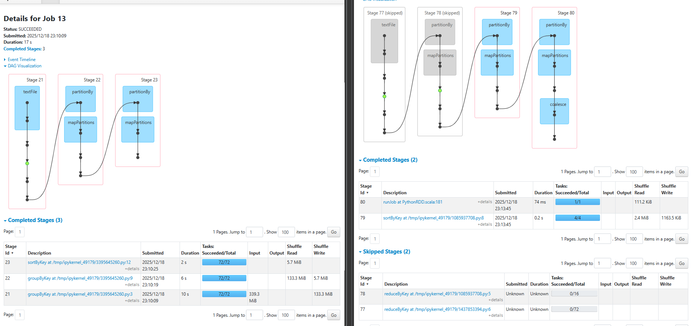
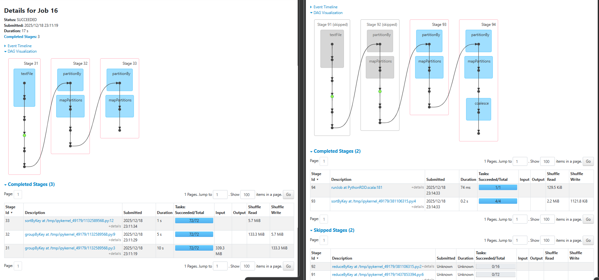

# Project for Big Data course (81932), University of Bologna (A.Y. 2025/26)

This repository contains all the instructions, code, and material used to develop and deploy the project for the Big Data course.

- Notebook: [project.ipynb](./src/main/python/project.ipynb)
- Application: [GHArchiveHypeIndex.scala](./src/main/scala/project/GHArchiveHypeIndex.scala)
- Sample dataset: [2024-01-01-0.json.gz](gh_data/2024-01-01-0.json.gz)

## Download the dataset

The datasets can be downloaded using the bash scripts:

- [download_only_sample_dataset.sh](./download_only_sample_dataset.sh)
- [download_full_dataset.sh](./download_full_dataset.sh)

## History Jobs

The history jobs can be found in `jobs_history` folder at:

- [Average Hype Index History](./jobs_history/avg_job/application_1766151418955_0002_1)
- [Max Hype Index History](./jobs_history/max_job/application_1766151418955_0004_1)

## Notes

The execution of the jobs will export the results in a csv file in the `output` directory 
The comparison between Non-Optimized and Optimized can be seen in the images below, obtained from the job history of the notebook execution:

- Average Job Comparison: 
- Max Job Comparison: 
